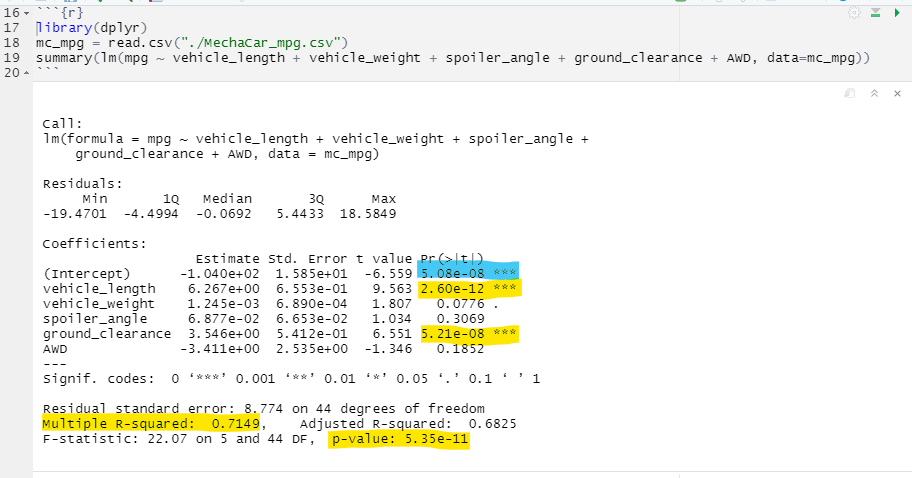
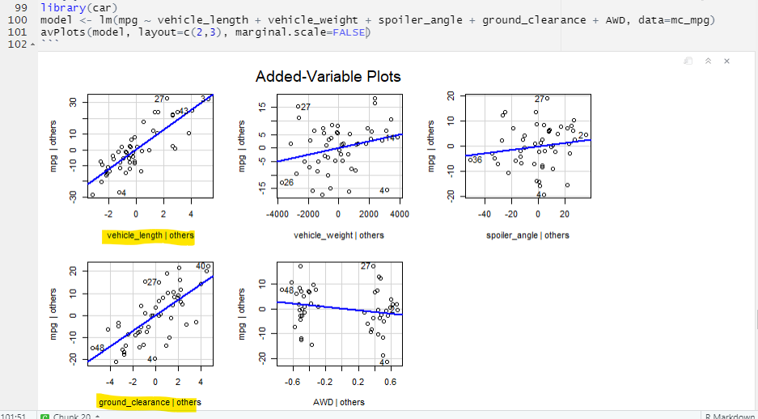
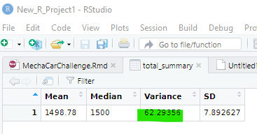
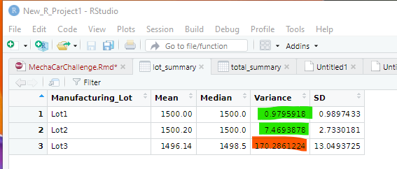
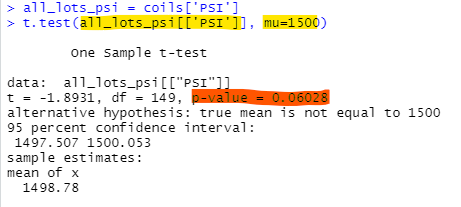
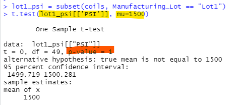
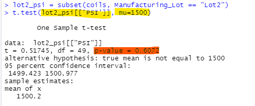
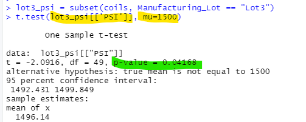

# MechaCar_Statistical_Analysis

We analyzed data for AutosRUs’ newest prototype, the MechaCar, which is suffering from production troubles that are blocking the manufacturing team’s progress. We helped the data analytics team to review the production data for insights that may help the manufacturing team.

Technologies Used:
- R
- tidyverse / dplyr package(s)
- RStudio

## Overview

- **Deliverable 1 - Linear Regression to Predict MPG**: Perform multiple linear regression analysis to identify which variables in the dataset predict the mpg of MechaCar prototypes

- **Deliverable 2 - Summary Statistics on Suspension Coils**: Collect summary statistics on the pounds per square inch (PSI) of the suspension coils from the manufacturing lots

- **Deliverable 3 - T-Test on Suspension Coils**: Run t-tests to determine if the manufacturing lots are statistically different from the mean population

- **Deliverable 4 - Design a Study Comparing the MechaCar to the Competition**: Design a statistical study to compare vehicle performance of the MechaCar vehicles against vehicles from other manufacturers. For each statistical analysis, you’ll write a summary interpretation of the findings.

## Results

## Linear Regression to Predict MPG

The MechaCar prototypes were produced using multiple design specifications to identify ideal vehicle performance. Multiple metrics, such as vehicle length, vehicle weight, spoiler angle, drivetrain, and ground clearance, were collected for each vehicle.

Figure 1. Multiple linear regression data for mpg vs. all independent variables

Figure 2. Linear regresson plots for mpg vs. each independent variable.

###### 1. Which variables/coefficients provided a non-random amount of variance to the mpg values in the dataset?

- **vehicle_length** with **p-value=2.60e-12** which is << 0.05
- **ground_clearance** with **p-value=5.21e-08** which is << 0.05

###### 2. Is the slope of the linear model considered to be zero? Why or why not?

- **No**. If the slope were zero, then there would be no correlation between **mpg** and the independent variables. However, we have **Multiple R-squared = 0.7149**, which indicates a strong correlation.

###### 3. Does this linear model predict mpg of MechaCar prototypes effectively? Why or why not?

- **Somewhat**. Since **(Intercept) != 0**, it mean that the intercept term explains a significant amount of variability in the dependent variable when all independent variables are equal to zero. It could mean that the significant features (e.g. vehicle_length and ground_clearance) may need scaling or transforming to improve the predictive power of the model. Alternatively, it may mean that there are other variables that can help explain the variability of our dependent variable that have not been included in our model.

## Summary Statistics on Suspension Coils

The manufacturing data for all lots (Figure 1 below) shows that the suspension coil variance is 62.29356, which is below the limit of 100 pounds per square inch.

Figure 3 - Lot Summary of suspension coils

However, the per-lot breakdown of the data shows Lot3 has a suspension coil variance of 170.2861224, which is above the limit of 100 pounds per square inch. Lot 1 (0.9897433) and Lot 2 (7.4693878) are within the variance limit.

Figure 4 - Total Summary of suspension coils

## T-Tests on Suspension Coils

Using our knowledge of R, we performed t-tests to determine if all manufacturing lots and each lot individually are statistically different from the population mean of 1,500 pounds per square inch. The results are shown in Figures 5 through 8 below. The only lot with a statistical difference is **Lot 3** (probably because of the high variance as shown in Figure 4 above).

Figure 5 - T-test for all lots vs. pop. mean of 1500 PSI - *no statistical difference*.

Figure 6 - T-test for lot 1 vs. pop. mean of 1500 PSI - *no statistical difference*.

Figure 7 - T-test for lot 2 vs. pop. mean of 1500 PSI - *no statistical difference*.

Figure 8 - T-test for lot 3 vs. pop. mean of 1500 PSI - **yes, a statistical difference**.

## Study Design: MechaCar vs Competition

Using our knowledge of R, we designed a statistical study to compare performance of the MechaCar vehicles against performance of vehicles from other manufacturers.

###### Description

- What metric or metrics will be tested?

    - *Overall Safety Rating*: Safety Ratings are available at https://www.nhtsa.gov/ratings. The 'overall' category is made up of various sub-categories like: Frontal Crash, Side Crash, Rollover, etc.; but we just need a **categorical** 'overall safety rating' (e.g. A, B, C, D, and F)

    -*Vehicle Weight**: We need the vehicle weight for all current cars. This can be converted into 'buckets' or **categories**. For example, for cars weighing 0.5 - 2.0 tons (e.g. 1000 - 4000 pounds), we would need twelve 250 pound weight 'categories'.

- What is the null hypothesis or alternative hypothesis?

    - *Null Hypothesis*: "Heavier cars are no safer than lighter cars"

    - *Alternative Hypothesis*: "Overall Safety Rating increases by one letter grade for each increasing weight" category of 250 pounds.

- What statistical test would will be used to test the hypothesis? And why?

    - *Chi-Squared Test*: This test can be used to determine if there is a difference in categorical frequencies between groups. For example: "*How many vehicles in the 2000-2250 pound category have a safety rating of B?*" vs. "*How many vehicles in the 2250-2500 pound category have a safety rating of B?*"

    - If the **p-value** of our *Chi-Squared Test* is below 0.05, then we can reject our *Null Hypothesis*, and we will know that increasing vehicle weight also increases overall safety rating.

- What data is needed to run the statistical test?

    - *Vehicle Weight data for all current vehicle models (including the MechaCar)*

    - *Crash Test Results converted into "Overall Safety Rating for all current vehicle models (including the MechaCar)*

## Summary

As has been the case for every Module in this bootcamp, this Challenge took much longer than the time estimate given in the online material.
However, it was a very interesting assignment.
I have only been exposed very lightly to statistics in college and/or grad school.
Even though it was extremely short, this introduction taught me a lot.

In addition, my first impression of the R Programming Language was not very positive.
However, by playing around with RStudio, the R and Rscript user-level commands, R Markdown files, Jupyter Notebook for R; and having seen the other online material about how programs can generate visually appealing documents via the Knit tool, etc.; I'm more impressed. If I have an opportunity to use R professionally in the future, I will look forward to learning more about it!
